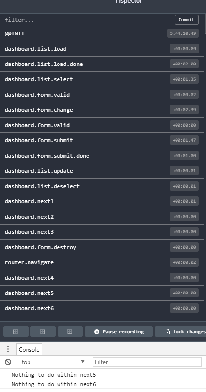

# redux-effects-promise

An implementation of declarative promises effects for redux. The solution is based on **inversify** library.

## Installation

```sh
npm install redux-effects-promise --save
```

## Dependencies

* [inversify](https://www.npmjs.com/package/inversify)
* [redux](https://github.com/reactjs/redux)

## Usage

```typescript
import 'reflect-metadata';
import { createStore } from 'redux';
import { Container } from 'inversify';
import { EffectsService, effectsMiddleware } from 'redux-effects-promise';

export const middlewares = [..., effectsMiddleware];
EffectsService.configure(new Container(), createStore(...));
```

```typescript
import { EffectsService } from 'redux-effects-promise';
...
@provide(DashboardListEffects)
export class DashboardListEffects {

	@lazyInject(DI_TYPES.Api) protected api: IApi;

	@EffectsService.effects('dashboard.list.load')
	loadProducts(): Promise<IProduct[]> {
		return this.api.loadProducts();
	}

    // Or ...
    // @EffectsService.effects('dashboard.list.load')
    // loadProducts(): IProduct[] {
    //    return [{ name: 'Product1', id: 1901 }, { name: 'Product2', id: 1902 }];
    // }
}
```

```typescript
import { AnyAction } from 'redux';
import { EffectsAction, EffectsService } from 'redux-effects-promise';
...
@provide(DashboardFormEffects)
export class DashboardFormEffects {

	@lazyInject(DI_TYPES.Api) protected api: IApi;

	@EffectsService.effects('dashboard.form.submit')
	saveProduct(action: AnyAction, state: IAppState): Promise<EffectsAction[]> {
		return this.api.saveProduct(action.data)
			.then(result => {
				return [
					EffectsAction.create('dashboard.form.submit.done', result),
					EffectsAction.create('dashboard.list.update', action.data),
					EffectsAction.create('dashboard.list.deselect'),
					EffectsAction.create('router.navigate', '/dashboard')
				];
			});
	}

	@EffectsService.effects('dashboard.back')
	back(action: AnyAction, state: IAppState): EffectsAction[] {
		return [
			EffectsAction.create('router.navigate', '/dashboard'),
			EffectsAction.create('dashboard.list.deselect')
		];
	}
}
```

## Preview



## License

Licensed under MIT.